# P-015 — Product Metrics Pack

> **Use case duy nhất:** Fraud Analyst / Human Reviewer hoàn tất việc xử lý một eligible suspicious case.<br>
> **Student decisions:** Core Action = A · Cadence = A · Metric Hypothesis = A.

---

## 00 — Dự án, persona, core job

### Project

**P-015 — AI-assisted Fraud Detection / Fraud Analysis**

Phạm vi của pack chỉ là đoạn workflow: transaction đáng ngờ trở thành case đủ điều kiện → analyst review evidence và risk/AI information → ghi nhận final disposition có rationale/evidence được lưu thành công.

### Persona: Fraud Analyst / Human Reviewer

Đây là một persona duy nhất: người chịu trách nhiệm review case và đưa ra disposition cuối cùng. Pack không gộp customer, administrator, ML engineer hay compliance manager.

### Core job

Khi một suspicious transaction case đến hàng đợi review, tôi cần hiểu evidence liên quan và thông tin risk/AI để đưa ra một quyết định có thể bảo vệ được, không phải chuyển qua nhiều hệ thống rời rạc.

### Scope boundary

- **In scope:** analyst nhận case, bắt đầu review, hoàn tất evidence cần thiết, submit final resolution và xử lý trạng thái reopen/reverse.
- **Out of scope:** model training, customer self-service, dashboard adoption nói chung và toàn bộ platform P-015.

---

## 01 — Core Action Card

### Candidate actions

| Candidate | Action | Near value | Repeatable | Observable | Meaningful | Influenceable | Nhận xét |
| --- | --- | --- | --- | --- | --- | --- | --- |
| **A** | Analyst completes and submits the final resolution of an eligible fraud case. | PASS | PASS | PASS | PASS | PASS | Gắn trực tiếp với disposition cuối cùng và có state transition đo được. |
| **B** | Analyst escalates a fraud case with sufficient supporting evidence. | PASS | PASS | PASS | PASS | PASS | Có giá trị nhưng chỉ phù hợp với nhánh escalation, không bao phủ mọi disposition. |
| **C** | Analyst confirms evidence and records a defensible case disposition. | PASS | PASS | PASS | PASS | PASS | Đúng hướng giá trị nhưng wording “confirms evidence” chưa chỉ rõ terminal transition. |

Các thao tác như `login`, `open_dashboard`, `open_alert`, `ask_ai`, `click_analyze` và `view_score` chỉ là funnel hoặc supporting events. Chúng có thể xảy ra mà chưa có quyết định được lưu, nên không phải Core Action.

### Human Decision Gate 1

**Student decision: CORE ACTION = A**<br>
Wording được giữ nguyên về ý nghĩa: **Analyst completes and submits the final resolution of an eligible fraud case.**

### Core Action Card

| Field | Definition |
| --- | --- |
| Target user | Fraud Analyst / Human Reviewer |
| Core job | Hiểu evidence và risk/AI information để đưa ra disposition có thể bảo vệ được. |
| Core action | Analyst completes and submits the final resolution of an eligible fraud case. |
| Object | Một eligible fraud review case / suspicious transaction case. |
| Preconditions | Case đã được assign hoặc trở nên available cho analyst; case chưa ở terminal state; analyst có quyền review; bộ trường quyết định bắt buộc đã có thể được lưu. |
| Completion rule | Chỉ hoàn tất khi case chuyển thành công từ non-terminal review state sang terminal disposition, required decision information và rationale/evidence references được persist thành công. |
| Core value | Giảm uncertainty và tạo ra một disposition có thể audit/defend cho case cụ thể. |
| Evidence of value | Persisted terminal state, valid disposition, required rationale/evidence references và một `fraud_case_resolved` event duy nhất cho resolution version. |
| Candidate event | `fraud_case_resolved` |

### Core Action self-check

| Criterion | Result | Rationale |
| --- | --- | --- |
| Near core value | PASS | Case có disposition cuối cùng, không chỉ có dữ liệu đầu vào hay output của hệ thống. |
| Repeatable | PASS | Mỗi eligible case mới tạo một cơ hội xử lý tương tự. |
| Observable | PASS | Có persisted state transition và event contract rõ ràng. |
| Meaningful | PASS | Quyết định là đầu ra nghiệp vụ mà analyst chịu trách nhiệm. |
| Influenceable | PASS | Product có thể cải thiện evidence presentation, workflow, AI context và persistence reliability. |

**Kết quả: 5/5 PASS.**

---

## 02 — Action Nature Card + kết luận cadence

### Action Nature Card

| Component | Analysis |
| --- | --- |
| Actor | Fraud Analyst / Human Reviewer. |
| Intent | Hiểu evidence để đưa ra final disposition có rationale. |
| Trigger | Một suspicious transaction/case đủ điều kiện xuất hiện hoặc được assign vào queue. |
| Effort | Điều tra evidence, xem risk/AI information, cân nhắc và lưu quyết định. |
| Value timing | Value xuất hiện khi terminal disposition và required decision information đã persist, không phải khi mở trang hay nhận model output. |
| State | Case đi từ non-terminal review state sang terminal disposition; lịch sử, rationale và evidence references được lưu. |
| Dependency | Nhu cầu đến từ transaction/case bên ngoài hành vi dashboard của analyst; hệ thống phải cung cấp case và dữ liệu review. |
| Repeat condition | Có một eligible case opportunity khác. Một khoảng không có case không được diễn giải là user churn. |

### Nature conclusion

Nature chính là **event-response workflow**, có đặc điểm workflow vì mỗi case cần một chuỗi review và persisted resolution. Đây không phải habit hằng ngày hay nhịp do dashboard đặt ra: analyst không tự tạo ra nhu cầu fraud-review bằng cách mở app.

### Human Decision Gate 2

**Student decision: CADENCE = A**

> Đối với Fraud Analyst / Human Reviewer, core action hoàn tất thường xuất hiện theo từng cơ hội review case đủ điều kiện vì nhu cầu review được tạo bởi transaction đáng ngờ bên ngoài dashboard và mỗi case cần một final disposition. Do đó, nhịp đo phù hợp là theo từng eligible-case opportunity ở cấp case; retention đối chiếu cơ hội đủ điều kiện tiếp theo.

### Cadence quality check

- **Higher action frequency không luôn đồng nghĩa với higher value.** Nhiều case có thể phản ánh nhiều suspicious transactions hơn, chứ không tự động phản ánh sản phẩm tốt hơn.
- Resolution nhanh hơn có thể có giá trị hơn việc analyst ở trong sản phẩm lâu hơn, nhưng chỉ khi vẫn đạt quality threshold và có persisted evidence/rationale.
- Nếu không có eligible case, analyst không bị phạt trong retention; đó là thiếu cơ hội quan sát, không phải evidence của churn.
- Calendar aggregation có thể được dùng để báo cáo quản trị, nhưng không định nghĩa natural cadence. Đơn vị hành vi là eligible case opportunity.

---

## 03 — Metric System

### Measurement principles

1. Một metric chỉ được dùng khi unit, inclusion/exclusion và event dependencies đã rõ.
2. Không dùng số lượt mở dashboard, prompt, model response hay thời gian session làm proxy cho value.
3. Không đưa số liệu lịch sử, benchmark, SLA, accuracy hay fraud-rate chưa có nguồn vào pack. Các ngưỡng dưới đây là product definitions ban đầu và cần được kiểm chứng bằng usage data thật.

**Eligible case opportunity** là một case đủ điều kiện được assign/available cho analyst, định danh bởi `case_id + assignment_version`. Retry của assignment không tạo opportunity thứ hai; một case được reopen giữ lịch sử opportunity cũ và có event riêng.

### 03.1 Activation

| Required component | Definition |
| --- | --- |
| Start event | `fraud_case_assigned` cho **first eligible case opportunity** của analyst. |
| Activation event | `fraud_case_resolved` của chính case đó, với valid terminal disposition, required decision information và successful persistence. |
| Time window | Từ lúc case được assign/available đến lúc opportunity của case đó kết thúc hoặc case được đóng/reassign theo workflow. Đây là operational window, không phải một mốc calendar áp đặt. |

**Unit:** analyst.<br>
**Activation rule:** analyst được activate khi first eligible assigned case đạt first meaningful value bằng một qualifying `fraud_case_resolved` trong cùng case opportunity.<br>
**Status:** Initial product definition — cần validation sau khi có usage data; không phải benchmark.

### 03.2 Engagement — hai góc nhìn

| Metric | Dimension | Definition / unit | Inclusion & exclusion | Events | Why it matters |
| --- | --- | --- | --- | --- | --- |
| Repeat qualifying-resolution rate | Frequency | Tỷ lệ eligible case opportunities tiếp theo có qualifying `fraud_case_resolved`, theo analyst đã activate. Unit: opportunity. | Mẫu số chỉ gồm opportunities thực sự được assign; loại test/bot/internal traffic và duplicate resolution. | `fraud_case_assigned`, `fraud_case_resolved` | Đo analyst có tiếp tục hoàn tất core action khi có demand mới hay không. |
| Evidence-complete resolution rate | Depth / quality | Số resolved cases có `fraud_evidence_completed` trước resolution chia cho tổng qualifying resolved cases. Unit: case. | Evidence phải được persist ở trạng thái complete trước `fraud_case_resolved`; case thiếu required evidence không đạt. | `fraud_evidence_completed`, `fraud_case_resolved` | Đo độ sâu của resolution thay vì thưởng cho thao tác nhiều nhưng hời hợt. |

### 03.3 North Star Metric (NSM)

**Tên:** High-quality resolution rate per eligible case opportunity.

NSM gồm đủ ba thành phần:

- **Unit of value:** một distinct eligible fraud case được resolved.
- **Quality threshold:** valid terminal disposition; required decision information và rationale/evidence references persist thành công; `fraud_evidence_completed` đã xảy ra trước resolution; không tính duplicate resolution cho cùng `resolution_version`.
- **Frequency:** tính trên từng eligible case opportunity; reporting có thể aggregate nhiều cơ hội nhưng không đổi natural cadence.

**Công thức:**

```text
NSM =
COUNT(DISTINCT case_id thỏa quality threshold và có fraud_case_resolved)
/
COUNT(DISTINCT opportunity_id của eligible case opportunities được assign)
```

Mẫu số chỉ gồm case opportunities đủ điều kiện đã được assign cho analyst trong scope quan sát. Không có eligible opportunity thì không tạo denominator giả. NSM không chứa actual value; đây là định nghĩa metric. Reopen và reversal được theo dõi bằng counter-metrics để phát hiện NSM tăng nhưng outcome xấu đi.

### 03.4 Leading indicators

| Metric | Definition | Why it could predict repeat core value | Event dependencies |
| --- | --- | --- | --- |
| Review-start conversion | Eligible assigned cases có `fraud_case_review_started` chia cho eligible assigned cases. Unit: case opportunity. | Nếu analyst bắt đầu review đúng case được assign, friction đầu funnel thấp hơn và cơ hội đi tới resolution cao hơn. | `fraud_case_assigned`, `fraud_case_review_started` |
| Evidence-complete-before-resolution rate | Resolved eligible cases có `fraud_evidence_completed` trước `fraud_case_resolved` chia cho resolved eligible cases. Unit: resolved case. | Evidence completeness là điều kiện gần với quality threshold và có thể báo trước repeat value bền vững. | `fraud_evidence_completed`, `fraud_case_resolved` |

### 03.5 Counter-metrics

| Counter-metric | Definition | What deterioration it catches | Event dependencies |
| --- | --- | --- | --- |
| Reopen rate | Resolved cases phát sinh `fraud_case_reopened` chia cho resolved eligible cases trong cùng scope. Unit: case. | Resolution tăng nhưng analyst hoặc downstream phải mở lại nhiều case hơn. | `fraud_case_resolved`, `fraud_case_reopened` |
| Reversal rate | Resolved cases phát sinh `fraud_case_reversed` chia cho resolved eligible cases trong cùng scope. Unit: case. | Disposition tăng nhưng quyết định bị overturn sau đó. | `fraud_case_resolved`, `fraud_case_reversed` |

Đây là product-event proxies, không phải false-positive rate hay model-accuracy claim. Nếu sau này có authoritative outcome labels, chúng có thể bổ sung quality validation.

---

## 04 — Retention Definition

Retention khớp với cadence event-response: return được tính khi có **eligible case opportunity tiếp theo**, không phải theo một ngày lịch cố định.

| Component | Definition |
| --- | --- |
| Unit | Một activated Fraud Analyst / Human Reviewer. |
| Cohort entry | Analyst có first qualifying `fraud_case_resolved` trên first eligible case opportunity. |
| Return event | Một qualifying `fraud_case_resolved` khác trên eligible case opportunity tiếp theo của cùng analyst. |
| Window | Các eligible case opportunities tiếp theo; operational readout chính quan sát 3 opportunities tiếp theo để phù hợp với metric hypothesis, nhưng chỉ tính opportunities thực sự tồn tại. |
| Threshold | `>= 1` qualifying repeat event trong window quan sát. |
| Segment | Activated analysts đã có ít nhất một eligible case opportunity được assign trong return window; phân tích cùng cohort/segment, loại bot, test account và internal traffic. |

### Vì sao không dùng retention theo calendar day

Fraud case demand đến từ bên ngoài. Analyst có zero eligible workload trong window không có cơ hội để phát sinh return event, nên không tự động được gắn nhãn churn. Những người đó được tách thành **not observed / no eligible opportunity**, thay vì đưa vào mẫu số retention như một failure.

### Ba comparison frames

1. **Natural cycle:** so sánh analyst qua các eligible case opportunities tiếp theo.
2. **Same relevant cohort/segment:** so sánh các analyst đã activate và thật sự có workload đủ điều kiện, với cùng rule loại test/bot/internal traffic.
3. **External category benchmark:** chỉ dùng khi có nguồn credible và scope tương đồng. Pack này không dùng benchmark bên ngoài và không bịa giá trị.

---

## 05 — Product Loop

### Main loop type

**Event-response workflow + accumulated saved state.** Giá trị tiếp tục đến từ case mới và state đã lưu giúp review sau đó có bối cảnh, evidence và rationale rõ hơn; loop không dựa trên streak, badge, notification hay gamification.

```mermaid
flowchart LR
    T1["Natural trigger: suspicious transaction trở thành eligible case"] --> A1["Core Action: analyst hoàn tất final resolution"]
    A1 --> V1["Immediate value: defensible disposition và giảm uncertainty"]
    V1 --> S1["Saved state: evidence, rationale, case history"]
    S1 --> T2["Next natural trigger: eligible case khác vào queue"]
    T2 --> A2["Core Action cycle 2: analyst hoàn tất resolution tiếp theo"]
    A2 --> V2["Repeat value: quyết định mới có evidence và rationale persisted"]
    V2 --> S2["Saved state updated: lịch sử review dày hơn"]
    S2 --> T3["Next eligible case opportunity"]
```



**Reason to return without notification:** analyst phải xử lý một eligible suspicious case mới để hoàn tất trách nhiệm review; saved evidence/rationale/case history làm cho lần review tiếp theo có continuity hữu ích. Nếu không có case mới thì không suy ra churn.

### Metric Hypothesis

**Student decision: METRIC HYPOTHESIS = A**

> Nếu loop này hoạt động, **High-quality resolution rate per eligible case opportunity (NSM)** sẽ tăng qua ba cơ hội case đủ điều kiện tiếp theo của analyst đã activate, vì evidence + rationale được lưu làm giảm friction lặp lại mà vẫn giữ ngưỡng chất lượng.

Đây là hypothesis có thể falsify bằng cohort cùng segment: nếu NSM không tăng, hoặc tăng cùng lúc reopen/reversal rate xấu đi, loop/value claim cần được xem lại.

---

## 06 — Tracking nhanh

### Core event contract table

Event names dùng `object_action` và chỉ biểu diễn state/record có ý nghĩa, không phải UI click.

| Event | Meaning | Exact emit condition | Metrics using it |
| --- | --- | --- | --- |
| `fraud_case_assigned` | Một eligible case opportunity được analyst nhận/được đưa vào queue của analyst. | Emit sau khi assignment/availability đã persist thành công và case đạt eligibility; không emit cho test, bot hoặc internal traffic. Idempotency key: `case_id + assignment_version`. | Activation start, repeat-resolution denominator, NSM denominator, retention segment. |
| `fraud_case_review_started` | Analyst bắt đầu một review state có thể đo được. | Emit khi backend persist lần chuyển eligible case từ available/assigned sang review state; không emit chỉ vì mở dashboard, mở alert, reload hoặc page view. Idempotency key: `case_id + review_start_version`. | Review-start conversion leading indicator. |
| `fraud_evidence_completed` | Bộ evidence bắt buộc của case đạt trạng thái complete. | Emit sau khi required evidence references/fields được persist và completeness rule trả về true; không emit cho từng click/add tạm thời. Idempotency key: `case_id + evidence_version`. | Evidence-complete rate, NSM quality threshold. |
| `fraud_case_resolved` | Case đã có final resolution hợp lệ và terminal state. | Chỉ emit sau khi transaction persistence thành công: non-terminal review state → terminal disposition, required decision information và rationale/evidence references đã lưu. Không emit khi click Resolve, mở modal hay API request bắt đầu. Idempotency key: `case_id + resolution_version`. | Activation, engagement frequency, NSM, retention return, metric hypothesis. |
| `fraud_case_reopened` | Một resolved case được đưa trở lại review state. | Emit sau khi authorized reopen transition được persist; không xóa/sửa lịch sử `fraud_case_resolved`. Idempotency key: `case_id + reopen_version`. | Reopen-rate counter-metric. |
| `fraud_case_reversed` | Disposition trước đó bị overturn/reverse theo một state change được persist. | Emit sau khi reversal record và trạng thái mới persist thành công; không dùng để rewrite resolution history. Idempotency key: `case_id + reversal_version`. | Reversal-rate counter-metric. |

### Acceptance criteria

**AC1 — Completion correctness**<br>
`fraud_case_resolved` chỉ được emit sau khi eligible case chuyển thành công từ non-terminal review state sang terminal disposition và required decision information đã persist.

**AC2 — No duplicate on retry/reload**<br>
Reload, autosave, network retry hoặc duplicate UI submit không được tạo event thứ hai cho cùng logical resolution transition. Consumer và producer phải nhận diện idempotency key `case_id + resolution_version` hoặc equivalent.

**AC3 — Reopen semantics**<br>
Case được reopen phải tạo `fraud_case_reopened` với version riêng; historical `fraud_case_resolved` không bị xóa hoặc rewrite.

**AC4 — Identity and eligibility**<br>
Bot traffic, test account và non-eligible internal events bị loại khỏi production metric computation và không được tạo cohort/denominator hợp lệ.

**AC5 — Quality ordering**<br>
Một case chỉ đạt NSM quality threshold khi `fraud_evidence_completed` của cùng case opportunity được persist trước `fraud_case_resolved`; event timestamps/versions phải đủ để kiểm tra thứ tự này.

### Metric ↔ event traceability matrix

| Metric | Required events | Computable? |
| --- | --- | --- |
| Activation | `fraud_case_assigned`, `fraud_case_resolved` | YES |
| Engagement #1 — Repeat qualifying-resolution rate | `fraud_case_assigned`, `fraud_case_resolved` | YES |
| Engagement #2 — Evidence-complete resolution rate | `fraud_evidence_completed`, `fraud_case_resolved` | YES |
| NSM — High-quality resolution rate | `fraud_case_assigned`, `fraud_evidence_completed`, `fraud_case_resolved` | YES |
| Leading #1 — Review-start conversion | `fraud_case_assigned`, `fraud_case_review_started` | YES |
| Leading #2 — Evidence-complete-before-resolution rate | `fraud_evidence_completed`, `fraud_case_resolved` | YES |
| Counter #1 — Reopen rate | `fraud_case_resolved`, `fraud_case_reopened` | YES |
| Counter #2 — Reversal rate | `fraud_case_resolved`, `fraud_case_reversed` | YES |
| Retention | `fraud_case_assigned`, `fraud_case_resolved` | YES |
| Metric Hypothesis | `fraud_case_assigned`, `fraud_evidence_completed`, `fraud_case_resolved` | YES |

Các event candidate không được chọn như `fraud_case_decision_submitted` và `fraud_case_escalated` không cần thiết cho use case đã scope: một event submit trung gian dễ nhầm intent với completed state, còn escalation không xảy ra với mọi final resolution.

---

## 07 — Revision

Core Action, cadence và metric hypothesis đã được student xác nhận lần lượt là A, A và A. Không có major post-validation change đối với ba quyết định này. Minor wording và tracking-contract clarifications được bổ sung trong gate audit để phân biệt intent với persisted completion, xử lý no-workload retention và ngăn duplicate events.
